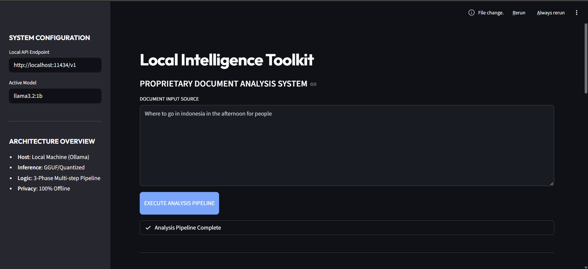

# Technical Report: My Local Text Analysis Project
**Student: Nicolas Febrero | NLP Course (S11)**

## 1. Description of the Problem
As I have been investigating throughout this semester, one of the biggest challenges we face when working with Natural Language Processing is the issue of data privacy (especially when we are dealing with sensitive information), so I decided to develop a system that could run entirely on my own computer without having to send any data to external servers. Since I noticed that many people just use a simple prompt-response approach, I wanted to go a bit further and build a complete tool that could actually understand what a text is trying to achieve (by identifying its intent) before just summarizing it, which I think is a much more robust way to handle real-world documents where the context is just as important as the words themselves.

## 2. System Design and My Workflow
The design I have been implementing centers around a multi-step pipeline that I started drafting after seeing some similar architectures in class (and also while I was looking for inspiration on internet forums), which basically means that the system doesn't just do everything at once but follows a logical sequence. 

First, I have been setting up an **Intent Analysis phase** where the model tries to figure out who the text was written for and what it wants to accomplish; then, I move on to the **Main Synthesis** where I am extracting the most important data and creating a dense summary; and finally, I have been adding a **Refinement step** (using a third internal call) where the model polishes all the previous information to give it a more formal and academic look that is easier to read.

## 3. Why I chose these Models
I ended up choosing **Llama 3.2 (1B version)** because, as I was seeing in the technical documentation of the models, it is incredibly efficient for running on standard laptops like mine that might not have a massive amount of video memory (VRAM). I have also been using **Ollama** as the engine to serve these models because I found it much easier to configure than other tools I tried before, and it allows me to switch between different models very quickly (if I ever want to try a bigger one like the 8B version) without having to change almost any of my Python code.

## 4. Implementation Details
For the construction of the application, I have been using **Streamlit** for the graphical interface (as we saw in the initial lab sessions) because it allows me to create a very elegant and responsive dark-mode environment with just a few lines of Python. I have also been integrating the **OpenAI library** to communicate with the local Ollama server, which I found to be a very clever way to maintain compatibility with modern industry standards while keeping everything 100% offline (this was a core requirement for me to ensure that no data ever leaves my hard drive).

## 5. Discussion and What I can Improve
From the tests I have been performing on my machine, the results have been quite impressive in terms of speed and coherence, although I have noticed that with very short texts the "refinement" phase sometimes feels a bit redundant. Looking ahead, I am thinking that I could probably improve this by adding **Vector Databases (RAG)** to handle much larger PDF files (something I was reading about recently) or maybe even implementing a way to choose between different tones of voice for the final report; but for now, I am quite happy with how the three-phase pipeline is working and how it manages to transform messy input into a very clear and formal executive summary.

---
### 6. Screenshots & Demo

[**Video Demo - Google Drive**](https://drive.google.com/file/d/18KEEa8ZbVodsCYqjer1rCWhhZtDiR8Mx/view?usp=sharing)

